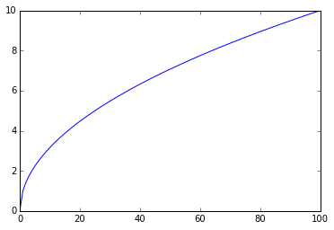

I did this in a jupyter notebook:

\# %matplotlib inline  
import numpy as np  
import matplotlib.pyplot as plt

trace\_norms = \[np.sqrt(np.eye(i).trace()) for i in range(100)\]

plt.plot(trace\_norms)

I get this logarithmic curve for all matrices so far

I got a similar curve for the below matrices:

*   hadamard
*   hankel
*   pascal
*   inverse pascal
*   hilbert
*   inverse hilbert
*   fourier
*   circulant

I may put together something more rigorous in future, as I am still curious as to why this happens.