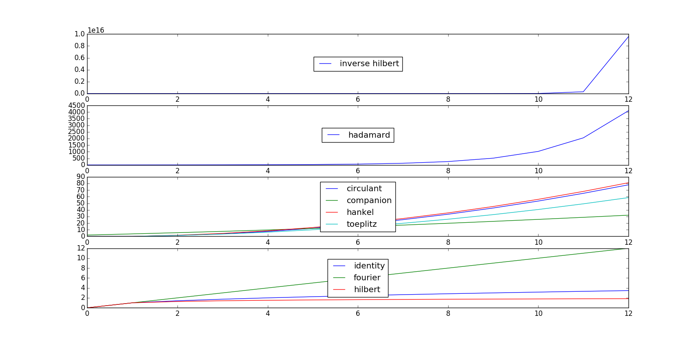

I had to keep the size of the matrices to 12x12, because some of the more complex types would cause to my laptop to hang indefinetely. I guess I could try on Amazon’s GPU cluster’s for fun sometime.

I used many of the matrices in scipy.linalg which made sense and weren’t too hard to get a norm using the approach in the code below. If you’ve never used the scipy library before, it’s a python library with a lot of scientific bells and whistles. See scipy.org if you’re interested.

Inverse hilbert is BY FAR the biggest!

Figure 1: x-axes are n for nxn matrices, y-axes give the norm of the trace for each. Code for each is shown below.

I’ve tried to write the code in the most straight-forward way for me to think about. Perhaps later I’ll re-do this in a more elegant fashion.

import numpy as np  
import scipy as sp  
from numpy import linalg as npla  
from scipy import linalg as spla  
from matplotlib import pyplot as plt  
  
identity\_list = \[  
    spla.norm(sp.eye(i), keepdims=True) for i in range(13)  
    \]

circulant\_list = \[  
    spla.norm(  
        spla.circulant(range(i)), keepdims=True) for i in range(13)  
    \]

companion\_list = \[  
    spla.norm(  
        spla.companion(  
            np.arange(1,i+3)), keepdims=True) for i in range(13)  
    \]

fourier\_list = \[  
    spla.norm(spla.dft(i), keepdims=True) for i in range(13)  
    \]

hilbert\_list = \[  
    spla.norm(spla.hilbert(i), keepdims=True) for i in range(13)  
    \]

hadamard\_list = \[  
    spla.norm(  
        spla.hadamard(2\*\*i), keepdims=True) for i in range(13)  
    \]  
   
hankel\_list = \[  
    spla.norm(  
        spla.hankel(  
            range(i), range(i)), keepdims=True) for i in range(13)  
    \]

invhilbert\_list = \[  
    spla.norm(spla.invhilbert(i), keepdims=True) for i in range(13)  
    \]

toeplitz\_list = \[  
    spla.norm(  
        spla.toeplitz(  
            range(i), range(i)), keepdims=True) for i in range(13)  
    \]  
  
fig = plt.figure()  
subplt1 = fig.add\_subplot(411)  
subplt2 = fig.add\_subplot(412)  
subplt3 = fig.add\_subplot(413)  
subplt4 = fig.add\_subplot(414)  
  
subplt4.plot(identity\_list, label='identity')  
subplt3.plot(circulant\_list, label='circulant')  
subplt3.plot(companion\_list, label='companion')  
subplt4.plot(fourier\_list, label='fourier')  
subplt2.plot(hadamard\_list, label='hadamard')  
subplt3.plot(hankel\_list, label='hankel')  
subplt4.plot(hilbert\_list, label='hilbert')  
subplt1.plot(invhilbert\_list, label='inverse hilbert')  
subplt3.plot(toeplitz\_list, label='toeplitz')  
subplt1.legend(loc='center')  
subplt2.legend(loc='center')  
subplt3.legend(loc='center')  
subplt4.legend(loc='center')  
plt.show()