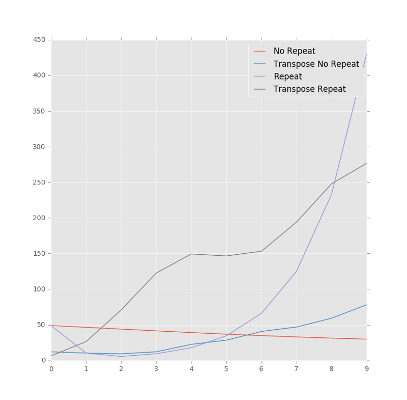

Alrighty then…

I made a few pretty graphs by taking the norm of each row and column of [previously mentioned matrices with primes.](https://medium.com/@atomcogs/weird-matrix-with-a-row-of-primes-in-it-59a46496ba3e#.616wcy7ni)

Here are the codez I didz:

from matplotlib import pyplot as plt  
from numpy import linalg as npla  
import primematrix as pm

norpt = pm.pmatrix\_norptcol()  
rpt = pm.pmatrix\_rptcol()

npla.inv(norpt)  
npla.inv(rpt)  
'''  
Haven't included the inverted matrices of the above,  
just doing it to say that they are invertible according  
to the numpy library.  
'''

npla.norm(norpt)  
\>>> 123.3288287465668

npla.norm(rpt)  
\>>> 513.29328848135151

plt.style.use('ggplot')  
plt.figure()  
plt.plot(\[npla.norm(row) for row in norpt\], label='No Repeat')  
plt.plot(\[npla.norm(row) for row in norpt.T\], label='Transpose No Repeat')  
plt.plot(\[npla.norm(row) for row in rpt\], label='Repeat')  
plt.plot(\[npla.norm(row) for row in rpt.T\], label='Transpose Repeat')  
plt.legend()  
plt.show()

Nothing complex, but if you aren’t familiar with the stuff above, it’s this:

1.  import plotting, linear algebra, and code from the weird matrix post before.
2.  make the matrices; repeated and norepeated in first column
3.  plt.figure makes a generic plot object which can hold multiple plots
4.  make the plots by going through each row and take the norm of that row
5.  include a legend so you can see which plot is which
6.  show it

By the way, the default norm from numpy.linalg.norm is the [Frobenius norm.](https://en.wikipedia.org/wiki/Matrix_norm#Frobenius_norm) [This function can take arguments to calculate several different norms if desired.](https://docs.scipy.org/doc/numpy-1.10.4/reference/generated/numpy.linalg.norm.html)

This kind of thing is fun and rewarding for someone like me. The whole process of thinking, understanding what I’m doing, representing this as code and outputting it visually, really is my jam. It’s pretty cool.

Therefore, without further ado, let me present the fruit of my labours:

Frobenius norms of weird matrices

Ahhh… that’s why I do what I do.

I find it interesting how the default norepeat matrix dips in size and then grows. I may take it upon myself to plot very large forms of these matrices in the near future.

Adios