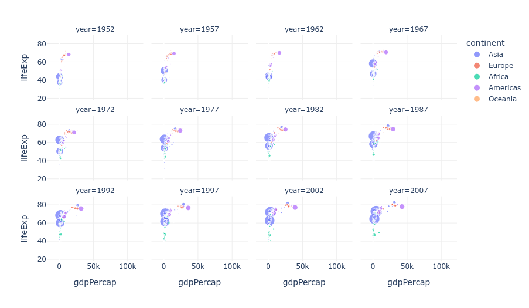
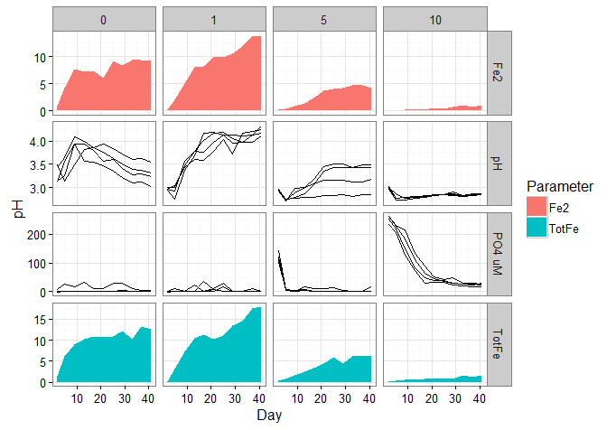

# Facetting

Facetting is the simple technique of taking your plots, shrinking them a bit and putting them in a grid.


Credit: Plotly, https://plotly.com/python/facet-plots/

So now you can look at them all in one glance without turning, scrolling or re-loading a page.
Usually it's for plots of the same type but with a variable changed for at least one axis, but it doesn't have to be.


Credit: Stack Overflow, https://stackoverflow.com/questions/37337068/ggplot-combine-line-and-area-in-same-panel-facet-grid

 - but your facet grid could contain multiple chart types if you want 
Credit: andrewirwin.github.io, https://andrewirwin.github.io/data-visualization/facets.html

- simple and effective technique
- increases information density i.e. saying more to your audience (T.Munzner should have some data on this)
  - with only a little increase in cognitive load i.e. your audience doesn't have to think a lot harder
- can use with any plot type
- can get an overview quickly and navigate data quickly at once

It's a very useful high-level starting point in a data tool to navigate really quickly without any typing or clicking to change filters.
Just pick the plot you want, click it to load a more detailed view or an entirely different report/dashboard.
Of course this takes work to set up, but saves time straight away, and it's an intuitive interface - no learning curve.

How to make a facet plot with excel:

1. Make all your plots
2. Shrink them and copy/paste them next to each other on a power point slide
3. ...
4. Profit!

Honestly don't know if there is an official way to do this in Excel. I asked an AI, it told be to buy a google subscription.
It also started its response with "Hmm,..." so I'll be subtracting points for that.
_However_ you can do it in PowerBI, using data from excel. See here:
https://support.microsoft.com/en-us/office/create-and-share-a-dashboard-with-excel-and-microsoft-groups-ad92a34d-38d0-4fdd-b8b1-58379aae746e

Oh wait, you want to actually _write some code_ and _process the data all by yourself??!!???_
Well then, see below...

Easy place to start is python with the seaborn library and the iris dataset.
This is an example from a larger tutorial, link below.

```
# Import seaborn
import seaborn as sns

# Apply the default theme
sns.set_theme()
# Load the iris dataset for examples
iris = sns.load_dataset("iris")

g = sns.PairGrid(iris, hue="species")
g.map_diag(sns.histplot)
g.map_offdiag(sns.scatterplot)
g.add_legend()

# save a png file of your plot in the location you ran this code
g.savefig('facetexample4.png')
```


Credit: Seaborn from PyData, https://seaborn.pydata.org/tutorial/axis_grids.html

So there you go, a straightforward, bang-for-your-buck technique that is sensible
for all audiences and makes you look smart.
